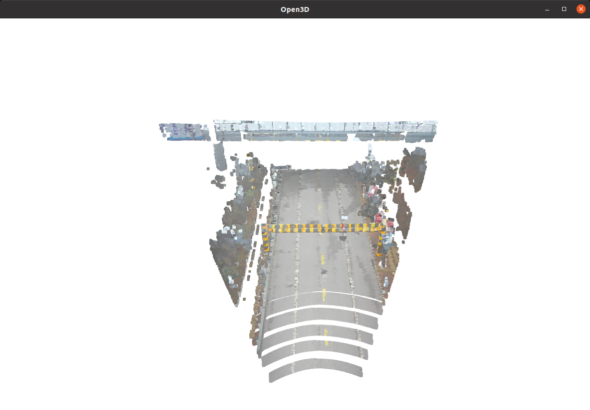
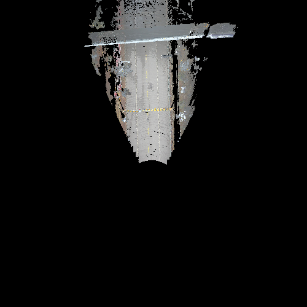
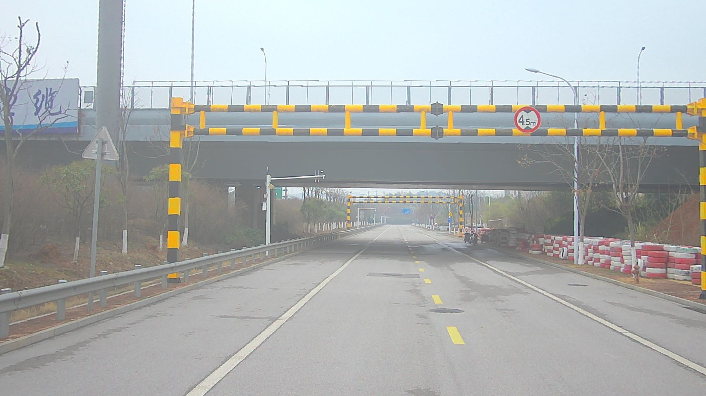

# 激光雷达-相机多传感器融合系统

## 项目概述

本项目是一个高性能的激光雷达-相机多传感器融合系统，实现了激光雷达点云的运动补偿、坐标变换、图像投影着色以及BEV（鸟瞰视角）地图生成。系统采用GPU加速计算，支持实时处理大规模点云数据。

## 功能特性

### 🎯 核心功能
- **多传感器融合**: 激光雷达与相机数据的时间同步与融合
- **运动补偿**: 校正激光雷达扫描过程中的运动畸变
- **点云着色**: 将相机颜色信息投影到激光雷达点云
- **BEV地图生成**: 创建彩色鸟瞰视角地图
- **GPU加速**: 使用PyTorch和CUDA实现高性能计算

### 🔧 技术特点
- 支持大规模点云数据的实时处理
- 精确的时间同步和位姿插值
- 高效的边界滤波和点云累积
- 可视化工具支持3D点云和BEV地图显示

## 技术流程细节

### 系统处理流程

系统采用多阶段处理流程，从数据加载到最终可视化，完整流程如下：

#### 1. 数据初始化阶段
```python
self.data_init(root)  # 加载所有传感器数据
```
- **图像数据**: 从 `undistort_Image/` 目录加载相机图像
- **激光雷达数据**: 从 `LidarData_original_bin/` 目录加载二进制点云
- **里程计数据**: 从 `LidarOdometry.txt` 加载位姿信息
- **时间戳处理**: 对所有时间戳进行排序，建立时间戳到数据的映射

#### 2. 时间同步循环
系统按图像时间戳顺序处理每一帧：
```python
for img_stamp in self.img_stamps:
    # 时间匹配
    lidar_idx, lidar_stamp = self.time_match(self.lidar_stamps, img_stamp)
    odom_idx, odom_stamp = self.time_match(self.lidar_odom_stamps, img_stamp)
```
- **时间匹配算法**: 使用最近邻搜索找到最接近的激光雷达和里程计时间戳
- **时间差阈值**: 使用 `TSS_GAP` 参数控制最大允许时间差
- **数据对齐**: 确保图像、激光雷达和里程计数据在时间上对齐

#### 3. 运动补偿处理
```python
compensated_points = lidar_sample.motion_compensation(cur_points, pre_odom, cur_odom)
```
- **扫描角度分配**: 将点云按水平扫描角度分配到0-1800个区间
- **时间比例计算**: 基于扫描角度计算每个点在扫描过程中的时间比例
- **位姿插值**: 使用SLERP（球面线性插值）进行四元数插值
- **坐标变换**: 将点云从扫描时刻校正到当前帧坐标系

#### 4. 位姿插值与投影
```python
t = (img_stamp - lidar_stamp) / (lidar_stamp - lidar_pre_stamp)
img_pose, img_quat = lidar_sample.inter_pose(pre_odom[:3], pre_odom[3:], cur_odom[:3], cur_odom[3:], t)
img_points = lidar_sample.projection(compensated_points, cur_odom[:3], cur_odom[3:], img_pose, img_quat)
```
- **时间比例插值**: 计算图像时间戳相对于激光雷达时间戳的比例
- **SLERP插值**: 使用球面线性插值计算图像时刻的精确位姿
- **坐标投影**: 将点云从激光雷达坐标系投影到图像坐标系

#### 5. 点云着色处理
```python
img_points = self.lidarTocamera(cur_img, img_points, compensated_points)
```
- **投影矩阵计算**: 使用相机内参矩阵将3D点投影到2D图像平面
- **边界检查**: 过滤超出图像边界的投影点
- **深度过滤**: 使用 `torch_scatter` 选择每个像素的最浅深度点
- **颜色提取**: 从图像中批量提取RGB颜色信息
- **点云着色**: 将颜色信息附加到对应的3D点云

#### 6. 点云累积与BEV地图生成
```python
accumulated_colored_points = lidar_sample.projection_accumulation(self.points_xyzrgb, self.odom_data)
bev_image = self.raster(accumulated_colored_points)
```
- **多帧累积**: 将多帧着色点云投影到当前坐标系
- **边界滤波**: 过滤超出地图边界的点云
- **高度选择**: 选择每个像素z轴高度最大的点进行着色
- **地图生成**: 生成彩色BEV鸟瞰地图

#### 7. 结果输出与可视化
```python
if SAVE: cv2.imwrite(bev_path, bev_image)  # 保存BEV地图
if VIS: cv2.imshow("BEV Map", bev_image)   # 显示BEV地图
```
- **文件保存**: 将BEV地图保存为PNG格式
- **实时显示**: 显示BEV地图和3D彩色点云
- **性能监控**: 输出处理时间和点云数量统计

### 关键技术算法

#### 运动补偿算法
- **角度编号分配**: 基于水平扫描角度将点云分配到1800个区间
- **时间比例计算**: `t = angle_indices / 1800.0` 归一化到[0,1]
- **SLERP插值**: 保证四元数插值的球面特性
- **坐标变换链**: 世界坐标系 ↔ 目标坐标系

#### GPU加速优化
- **批量矩阵运算**: 使用 `torch.matmul` 替代循环操作
- **散射操作**: 使用 `torch_scatter` 进行高效的点云聚合
- **内存优化**: 最小化GPU-CPU数据传输
- **并行处理**: 边界检查和滤波的并行执行

#### BEV地图生成
- **坐标转换**: 世界坐标到像素坐标的线性映射
- **高度选择**: `scatter_min(-points_z)` 选择最高点
- **颜色映射**: 保持原始RGB颜色信息
- **图像生成**: 使用向量化操作创建BEV图像

## 系统架构

### 主要类结构

#### 1. Lidar类 - 激光雷达数据处理
```python
class Lidar():
    """激光雷达数据处理类，负责点云加载、运动补偿、坐标变换等"""
```

**主要方法:**
- `load_lidarbin()`: 加载并预处理激光雷达二进制文件
- `motion_compensation()`: 运动补偿主函数
- `projection()`: 坐标投影函数
- `projection_accumulation()`: 点云累积投影

#### 2. fusion类 - 多传感器融合
```python
class fusion():
    """多传感器融合类，负责激光雷达与相机数据融合、时间同步、点云着色等"""
```

**主要方法:**
- `lidarTocamera()`: GPU加速的激光雷达到相机坐标变换
- `raster()`: GPU加速的BEV地图生成
- `time_match()`: 时间戳匹配
- `run()`: 融合处理主函数

## 安装依赖

### 系统要求
- Python 3.7+
- CUDA 11.0+
- PyTorch 1.8+
- OpenCV 4.0+

### Python依赖
```bash
pip install torch torch-scatter open3d opencv-python matplotlib numpy
```

## 使用方法

### 1. 数据准备
数据集下载链接: https://pan.baidu.com/s/1utQJAYZ1j6Mrx7_CfezHeg 提取码: xpu7
将数据集放置在 `Dataset/` 目录下，结构如下：
```
Dataset/
├── 2025-02-25-14-22-23/
│   ├── undistort_Image/          # 相机图像
│   ├── LidarData_original_bin/   # 激光雷达二进制数据
│   ├── LidarOdometry.txt         # 激光雷达里程计数据
│   └── ...
```

### 2. 运行系统
```python
# 主程序入口
if __name__ == "__main__":
    root = "./Dataset/2025-02-25-14-22-23"
    fusion_sample = fusion()
    fusion_sample.run(root, VIS=True, SAVE=True)
```

### 3. 参数配置
在 `common_struct.py` 中配置系统参数：
- `MAP_SIZE`: BEV地图尺寸
- `RESOLUTION`: 地图分辨率
- `TIME_LEN`: 时间窗口大小
- `TIME_GAP`: 累积间隔
- `TSS_GAP`: 时间同步阈值

## 可视化结果

系统提供多种可视化方式：

### 1. 3D彩色点云可视化


### 2. BEV鸟瞰地图


### 3. 前视图像



## 文件结构

```
color_point/
├── color_point.py          # 主程序文件
├── common_struct.py        # 参数配置和数据结构
├── README.md              # 项目文档
├── Dataset/               # 数据集目录
├── bev_map/              # 生成的BEV地图
└── docs/                 # 文档和示例图像
```


*最后更新: 2025-11-12*
